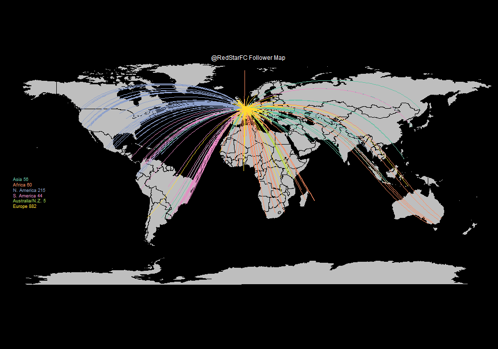
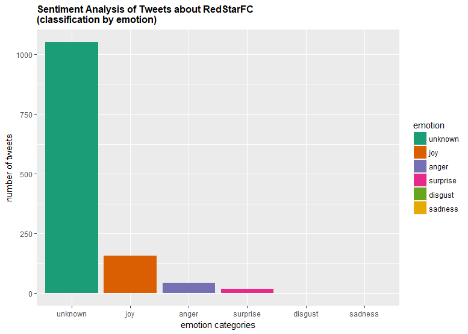
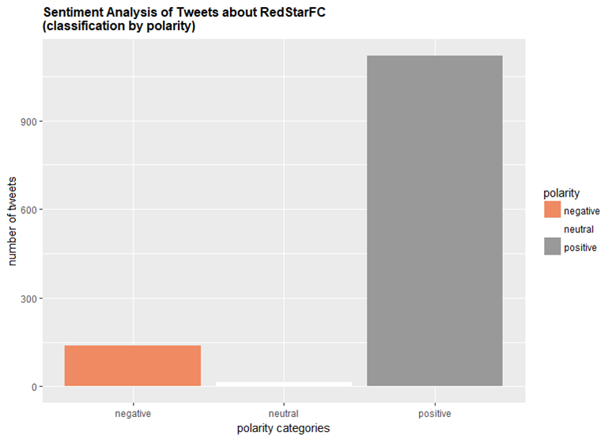
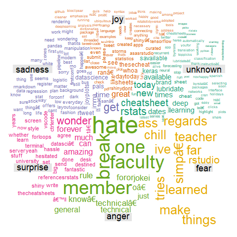
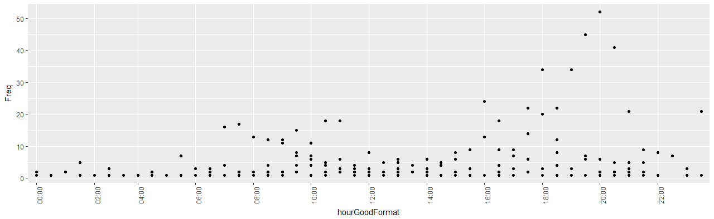

# Mining-Twitter

Shiny App to text mine data from Twitter about any account. This require to have a Twitter account.
This app presents several graphs, such as:
* A map with a connection between the location of the account you entered the name of (ex : "RedStarFC", a French Football Club), and its followers' location.

* A world cloud with the most common words associated to the account

* Graphs about the sentiments related to the tweets about the account, and the polarity (positve or negative)

* A daily timeline to determine when the account is the more/the less tweeted

This may be useful to determine the profile of users following/tweeting about the filled account. I am also working on a similar project on Facebook using Web scrapping.

## Getting Started

These instructions will get you a copy of the project up and running on your local machine for development and testing purposes.

### Prerequisites

You need for this to clone the files, and to have a Twitter account. On app.R, you need to fulfill the keys on the file by following [this](https://auth0.com/docs/connections/social/twitter) kind of tutorials.

### Installing

Once the keys filled, you only need to run the "setup.R" the first time. The following times, just run app.R.

## Built With

* [RStudio](https://www.rstudio.com/) - R IDE
* [Twitter API](https://developer.twitter.com/en/docs/api-reference-index) - To access the data
* [Sentiment Analysis Package](http://cran.r-project.org/src/contrib/Archive/sentiment/sentiment_0.2.tar.gz) - To analyse sentiments from tweets

## Authors

* **Benoit Audigier** - *Initial work* - [BenoitAudigier](https://github.com/BenoitAudigier)

## Acknowledgments

* Large inspiration from http://biostat.jhsph.edu/~jleek/code/twitterMap.R for the map of the followers/following of a Twitter account
